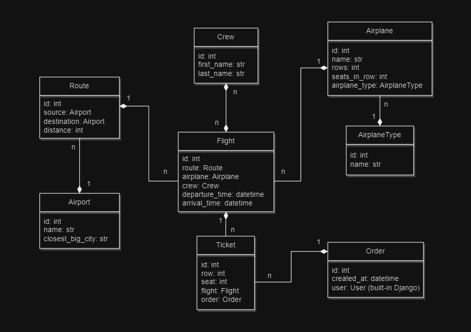
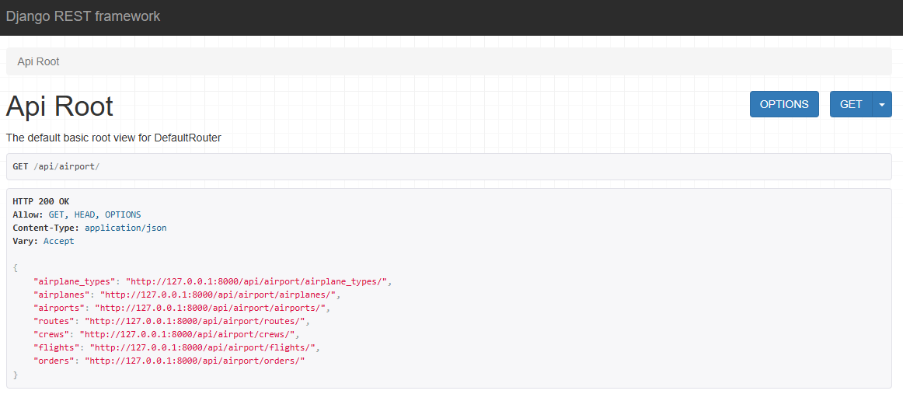
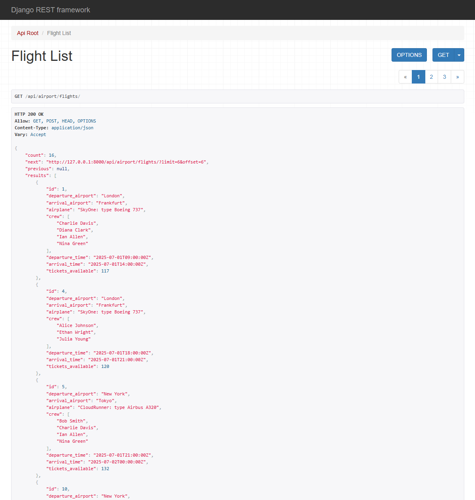
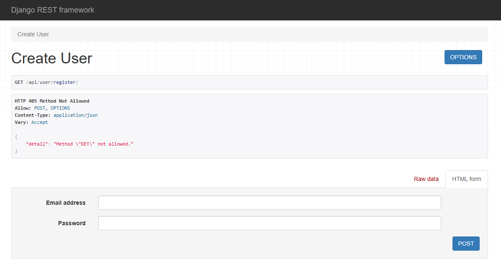
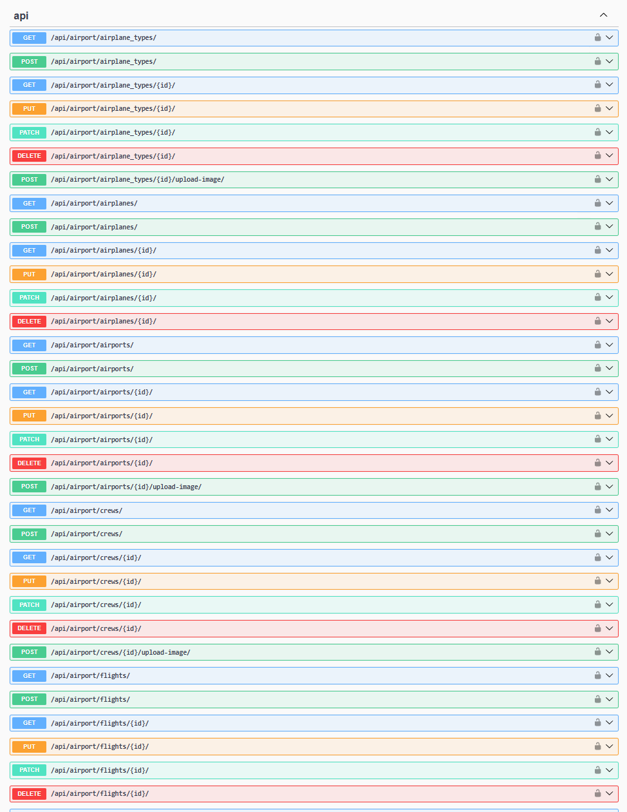

# Airport API Service ✈️

## Description
- Airport API Service is a web application built with Django.
- It helps to manage and track flights between airports around the world.
- The system allows users to work with airplanes, airports, routes, crews, and flights.
- This app is useful for organizing and buying flight tickets.


## Project Features:
- **Airplane Types:** Add and group airplanes by type. You can also upload images.
- **Airplane Management:** Set the number of rows and seats in each airplane.
- **Crew Management:** Add crew members with their first and last names, and upload photos.
- **Airport Management:** Add airports with name, image, and nearest big city.
- **Routes:** Create connections between two airports and set the distance.
- **Flights:** Add flights with airplane, crew, route, and departure/arrival time.
- **Orders and Tickets:** Registered users can buy tickets for flights. Each ticket has a row and seat.
- **Admin Panel:** Admins can add, edit, and delete all data through a built-in interface.
- **Authentication:** Users log in and get a JWT token to access protected features.
- **Filtering Support:**
  - Flights can be filtered by departure airport, arrival airport, and departure date
  - Airports can be searched by nearest big city name
  - This makes it easy to find only the data you need.
- **Permissions:**
  - Guests can view most data, but not orders
  - Registered users can view everything and create orders
  - Admins have full access to all actions


## Installation and Setup

To get started with the Airport API Service, follow these steps:

### Step 1: Clone the Repository

```bash
git clone https://github.com/rezehor/airport-api-service.git
```

### Step 2: Prepare the Environment
Make sure you have the following installed:

- Python 3.10 or higher

- PostgreSQL database

- Docker (optional)

Create and activate a virtual environment:

**Windows:**
```bash
python -m venv venv
venv\Scripts\activate
```
**Mac/Linux:**
```bash
python3 -m venv venv
source venv/bin/activate
```

### Step 3: Install Dependencies
```bash
pip install --upgrade pip
pip install -r requirements.txt
```

### Step 4: Environment Variables
Create a .env file and provide the required values:
```bash
POSTGRES_USER=your_postgres_user            # e.g. airport
POSTGRES_PASSWORD=your_postgres_password    # e.g. airport
POSTGRES_DB=your_database_name              # e.g. airport
POSTGRES_HOST=your_database_host            # e.g. db
POSTGRES_PORT=5432                          # usually 5432
PGDATA=/var/lib/postgresql/data             # default value
```

### Step 5: Database Setup
Run the following commands to apply migrations:
```bash
python manage.py makemigrations
python manage.py migrate
```

### Step 6: Run the Server
```bash
python manage.py runserver
```

### Optional: Run with Docker
Make sure Docker and Docker Compose are installed and running:
```bash
docker-compose build
docker-compose up
```

### Getting Access:
- **create a user:** /api/user/register
- **get access token:** /api/user/token

### DB Structure:


### Endpoints:


### Flight List:


### Registration:


### Swagger:

